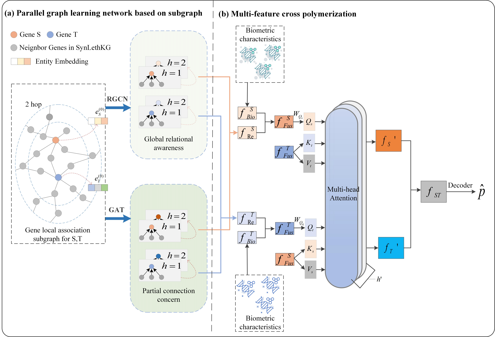

# MCKG-SL: Knowledge Graph-based Multi-feature Cross-aggregation Synthetic Lethality Prediction for KRAS gene

## Project Description

KRAS (Kirsten rat sarcoma viral oncogene homolog) is the most commonly mutated oncogene in human cancer. Targeting synthetic lethal (SL) partners in the setting of oncogenic KRAS is an alternative therapeutic strategy for KRAS-mutant malignancies. However, existing SL prediction algorithms are limited by incomplete understanding of complex biological system interaction networks or ignore some information in the local association of gene pairs. To overcome these challenges, we propose a novel Knowledge Graph-based Synthetic Lethality model named MCKG-SL, which learns the interaction information between genes with multi-feature cross aggregation. First, MCKG-SL extract local association subgraph of gene pairs from the knowledge graph, to focus on the local association information around gene pairs. Then, we utilize Relational Graph Convolutional Network (RGCN) for global relational awareness and Graph Attention Network (GAT) for partial connection concern to learn the gene feature information in the subgraph. Subsequently, we design a multi-feature cross aggregation module to cross-fuse the relational features learned from the local association subgraph with biological features extracted from multi-omics data, enhancing the interactive learning of gene pair features. A large number of experimental results show that MCKG-SL method is superior to other advanced methods in SL prediction, and has strong generalization ability. 

Besides, pathway analysis and SL analysis with  MCKG-SL suggest that there is a potential synthetic lethal relationship between KRAS and CDK3 (Cyclin-Dependent Kinase 3), and synthetic lethal between KRAS and TP53 (Tumor Protein P53) play an important role in the Bladder cancer.

## Environment Setup

### 1. Create Conda Environment
```bash
conda create -n MCKG-SL python=3.8
conda activate MCKG-SL
```

### 2. Install Dependencies
```bash
pip install -r requirements.txt
```

## Quick Start

### Training the Model
```bash
python train.py --dataset C1:cv_1
```

### Complete Training Command
```bash
python train.py \
  --dataset C1:cv_1 \
  --gpu 0 \
  --num_epochs 100 \
  --early_stop 5 \
  --lr 0.0001 \
  --batch_size 64 \
  --hop 2 \
  --enclosing_sub_graph True
```
## Key Hyperparameters

| Parameter | Value | Description |
|-----------|-------|-------------|
| early_stop | 5 | Early stopping patience |
| lr | 0.0001 | Learning rate |
| clip | 1000 | Gradient clipping threshold |
| l2 | 1e-5 | L2 regularization coefficient |
| max_links | 250000 | Maximum training links |


## Model Features

- **Local Association Subgraph Extraction**: Focuses on localized association information around gene pairs
- **Dual-network Architecture**: Combines RGCN for global relational awareness and GAT for local connection attention
- **Multi-feature Cross-aggregation**: Integrates relational features with biological features from multi-omics data
- **Enclosing Subgraph Strategy**: Captures relevant neighborhood information efficiently

## Notes

- Subgraph datasets are automatically generated on first run
- Ensure sufficient GPU memory for graph data processing
- Adjust `max_links` parameter to control memory usage
- `num_workers=0` is suitable for debugging; increase for production use

## Output

Training process generates:
- Model checkpoints
- Training logs  
- Evaluation results
- Experiment configuration backups



